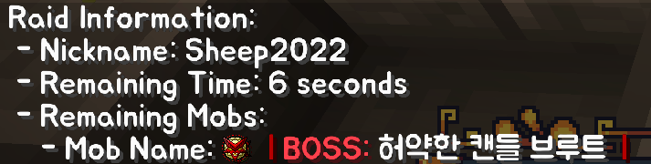
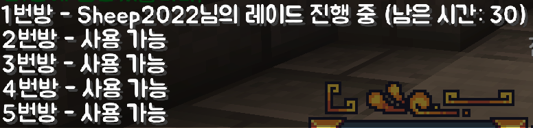
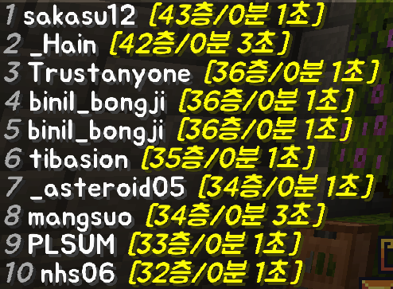
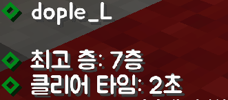

# 바벨탑 플러그인

이 플러그인은 메이플 스토리의 무릉도장에서 영감을 받아 제작되었습니다. 플레이어는 1층부터 시작하여 해당 층의 몬스터를 격파하고 보상을 받으며 올라가는 방식으로 게임을 진행합니다.

## 의존하는 플러그인

- CoordinatePlugin-Bukkit: 좌표 설정과 관련된 플러그인 
- MythicMobs: 몬스터 스폰과 관련된 플러그인 
- RpgSharp: 보상 지급과 관련된 플러그인 

## Commands

### AdminCommands

- `/바벨탑 보상설정 <층 수>`:  
  해당 층의 보상을 설정합니다.  
   
- `/바벨탑 방설정 <방번호> <유저스폰|몹스폰> <추가|초기화>`:  
  해당 방의 유저 스폰 또는 몹 스폰 위치를 추가하거나 초기화합니다.  
   
- `/바벨탑 방삭제 <방번호>`:  
  해당 방을 삭제합니다.  
   

### UserCommands

- `/바벨탑 진행상태`:  
  현재 자신이 격파 중인 바벨탑 진행 상황을 표시합니다.   
   
   
- `/바벨탑 방목록`:  
  바벨탑을 진행하는 방들의 진행 상황을 알려줍니다.   
   
   
- `/바벨탑 입장 [층 수]`:  
  해당 층의 바벨탑에 입장합니다.   
  (층 수 입력 없을시 최고 기록 +1)   
  [실제 플레이 영상](https://youtu.be/HiRO_va2uuU) 
   
- `/바벨탑 랭킹`:  
  바벨탑 랭킹을 표시합니다.   
  (기준: 격파한 최고층 ASC, 격파한 최고 층 클리어 시간 DESC)   
   
   

- `/바벨탑 정보 [닉네임]`:  
  해당 닉네임의 격파한 최고층, 클리어 시간을 표시합니다.   
  (닉네임 입력 없을시 자기 자신의 바벨탑 정보 표시)   
   
   
## 업데이트 로그

### v1.0.0

- 초기 릴리스

### v1.0.1

- 플레이어 식별 키를 닉네임에서 UUID로 변경
